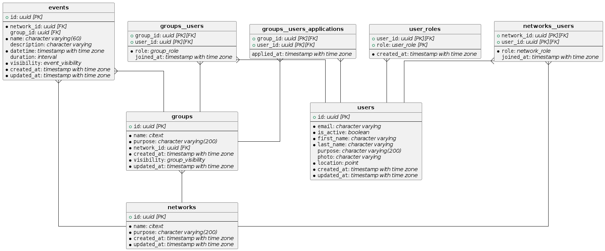

# Generate UML Entity Relationship Diagrams w/ Postgres & PlantUML

``` dockerfile
FROM postgres:15-alpine AS pg

WORKDIR /sql

COPY ./sql/ /sql/

COPY --from=golang:1.16-alpine /usr/local/go/ /usr/local/go/

RUN mkdir /gopath
ENV GOPATH /gopath
ENV PATH "/usr/local/go/bin:${GOPATH}/bin:${PATH}"

RUN go get github.com/achiku/planter

RUN mkdir /erd \
 && su postgres -c "initdb && pg_ctl -D /var/lib/postgresql/data start" \
 && psql -U postgres -f /sql/schema.sql \
 && planter postgres://postgres@localhost?sslmode=disable -o /erd/schema.uml

FROM plantuml/plantuml:sha-cfe2b60 AS erd

WORKDIR /erd

COPY --from=pg /erd/ /erd/

RUN java -jar /opt/plantuml.jar -verbose schema.uml
```

``` sh
$ docker build . -t moea/erd
$ id=$(docker create moea/erd)
$ docker cp $id/erd/schema.png .
$ docker rm -v $id
$ open schema.png
```


